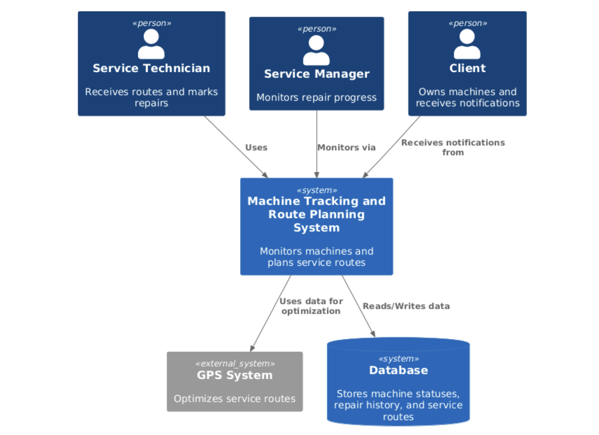

**Author:** Patryk Opiela

---

## 🛠 Project Title

**Automation of the parts replacement process on production floors**

---

## 📌 Use Cases – Machine Tracking and Route Planning System

### Service Technician

- **UC-01: View Assigned Routes**  
  Actor: Service Technician  
  Description: View daily route with assigned machines.

- **UC-02: Mark Machine as Repaired**  
  Actor: Service Technician  
  Description: Mark a machine as repaired to update its status.

- **UC-03: Attach Repair Note or Photo**  
  Actor: Service Technician  
  Description: Upload a photo or note describing the completed repair.

### Service Manager

- **UC-04: Monitor Machine Warnings**  
  Actor: Service Manager  
  Description: View list of machines currently reporting warnings.

- **UC-05: View Machine Status on Map**  
  Actor: Service Manager  
  Description: See machines on a map with status indicators.

- **UC-06: Track Technician Progress**  
  Actor: Service Manager  
  Description: View technician locations and route completion in real-time.

- **UC-07: Review Machine Repair History**  
  Actor: Service Manager  
  Description: View past service records and history for a machine.

### Notifications

- **UC-08: Notify Technician of New Assignment**  
  Actor: System  
  Description: Notify technician when a new task is assigned.

- **UC-09: Notify Clients of Completed Repair**  
  Actor: System  
  Description: Notify clients when their machine is serviced.

### System

- **UC-10: Poll Machine Telemetry**  
  Actor: System  
  Description: Monitor machine status and create warnings based on thresholds.

- **UC-11: Compute Optimal Routes**  
  Actor: Route Optimization Module  
  Description: Calculate the most efficient route for a technician.

### Admin

- **UC-12: Define Warning Conditions**  
  Actor: Admin  
  Description: Set rules for triggering warnings based on machine metrics.

- **UC-13: Monitor Background Job Failures**  
  Actor: Admin  
  Description: Be alerted when critical background jobs fail.

---

## ✅ User Stories

### Service Technician

- As a service technician, I want to receive my daily route with a list of machines to service so that I know where to go and what needs attention.
- As a service technician, I want to mark a machine as repaired through the mobile app so that the system updates its status and informs the service manager.
- As a service technician, I want to upload a photo or note about a repair so that I can document the work done.

### Service Manager

- As a service manager, I want to see a list of machines with active warnings so that I can prioritize which ones to service first.
- As a service manager, I want to see machine locations on a map with color-coded statuses so that I can understand where the problems are.
- As a service manager, I want to track technician progress in real-time so that I can manage delays and reroute if needed.
- As a service manager, I want to review a machine’s repair history so that I can identify patterns or recurring issues.

### Notifications

- As a service technician, I want to be notified when I get a new task so that I don't have to check manually.
- As a client, I want to be notified when my machine is repaired so that I know the issue was resolved.

### System & Optimization

- As a system, I want to receive and store machine status updates so that I can detect warnings and show machine history.
- As a route optimization engine, I want to calculate the best service route so that technicians save time and fuel.

### Admin & Maintenance

- As an admin, I want to define what conditions trigger a warning so that the system works for different machine types.
- As a developer/admin, I want to be alerted when system jobs fail so that I can fix them quickly.

---

## 🧱 C4 Model Diagrams

### Level 1: Context Diagram  

### Level 2: Container Diagram  

### Level 3: Component Diagram – Backend / API (Django + GraphQL)  

---
